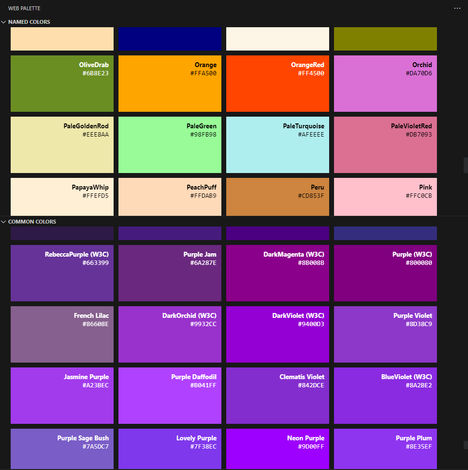

# Henry Refactors

Some neat little additions I just wanted to add for my own use. You can use them too if you like.

## Features

### Henry Align

An alignment command that aligns selected text by all special characters.

**Note:** Only works correctly with *multiple* selection. Lines will be concatenated if you select the full text all in one selection.

### CSS Preview

Preview selected CSS - uses Emmet to expand CSS selectors into HTML so you can preview your styles before creating the page.

Emmet expansions can also work on commented text if you highlight specifically the insides of the comment

### Web Palette

A helpful panel for seeing many named colors that copy when clicked.

Now with customization and filtering as of 0.2.0:

### Language Check

An isolated mini-editor for quickly testing out programming language features without starting a new project.

Uses `Function()` to execute code and has a custom-defined `console` object for printing output within the extension panel itself.

#### Limitations:

- `eval()` has been intentionally shadowed with a function that does nothing and throws an error.
- Only JavaScript is supported at the moment.
- Syntax highlighting is not supported yet.  
I wanted to implement at least something basic for comments, but unfortunately I couldn't get it to work smoothly within the `textarea` element...

## Known Issues

- Henry Align adds trailing whitespace.
- Henry Align doesn't necessarily align matching text sections.
- Running CSS Preview while not having text selected can cause errors.
- CSS Preview command must be re-executed to refresh, which creates a new webview instance every time.
- CSS Preview is not very flexible and can error easily in many situations. This includes the use of `:has()`, `:hover`, `::after`, and other things that cannot actually be expanded by Emmet.
- Web Palette doesn't copy color to clipboard when clicking labels - expected behavior is to copy the color name instead of hex code.

## Release Notes

*The extension is still in development and not yet fully released.*
